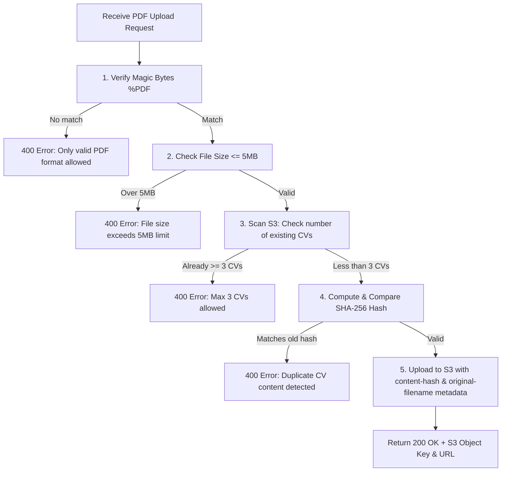

---
title : "Databases & Storage (Create SavedJobs Table and S3 CV Storage)"
date : 2026-07-02
weight : 2
chapter : false
pre : " <b> 5.4.2. </b> "
---

Store structured information for favorited jobs (wishlist) in DynamoDB and store users' PDF resumes in an Amazon S3 Bucket with strict security validation mechanisms.

---

## 1. Detailed Data Flow

### A. DynamoDB Table Interaction: `SavedJobsTable` (Favorite Jobs)
* **Key Structure:**
  * **Partition Key (PK):** `userId` (String `S`, extracted from Cognito Claim `sub`).
  * **Sort Key (SK):** `jobId` (String `S`, ID of the job post).


| Operation (HTTP Method) | Input Received | Business Logic | Output Returned |
| :--- | :--- | :--- | :--- |
| **Add Favorite** (`POST /saved-jobs/{jobId}`) | Headers: `Authorization: Bearer <Token>` Path: `jobId` = "job-abc" | Retrieve `userId` from token. Call `PutItem` storing: `userId`, `jobId`, `savedAt` (ISO String). | `HTTP 201 Created`<br>`{ "message": "Job saved successfully", "item": { "userId": "...", "jobId": "job-abc", "savedAt": "2026-07-01T15:00:00.000Z" } }` |
| **Remove Favorite** (`DELETE /saved-jobs/{jobId}`) | Headers: `Authorization: Bearer <Token>` Path: `jobId` = "job-abc" | Retrieve `userId` from token. Call `DeleteItem` with PK = `userId`, SK = `jobId`. | `HTTP 200 OK`<br>`{ "message": "Job removed from saved list" }` |
| **Get Favorites List** (`GET /saved-jobs`) | Headers: `Authorization: Bearer <Token>` | Retrieve `userId` from token. Run a `Query` command for all records matching PK = `userId`. | `HTTP 200 OK`<br>`{ "count": 1, "items": [ { "userId": "...", "jobId": "job-abc", "savedAt": "..." } ] }` |

You can check the saved job records directly in the DynamoDB Console Items tab:


### B. Amazon S3 Storage Interaction: `CvBucket` (CV PDF Storage)
* **Storage Naming Convention:** Objects are saved under the key: `${userId}/cv_${timestamp}.pdf`.
* **Validation & Security Flow for Uploads:**
  1. **Magic Bytes Verification:** Read the first few bytes of the file stream to verify they match the `%PDF` signature (`25 50 44 46` in hex) to block malicious executables disguised as PDF files.
  2. **File Size Check:** Validate that the uploaded file size is less than or equal to 5MB (`5 * 1024 * 1024` bytes).
  3. **Limit check:** List objects in the bucket with the prefix `userId/`. If the user already has 3 or more CVs, reject the upload request.
  4. **SHA-256 Hash Deduplication:** Calculate the SHA-256 hash of the file content. Compare it with the `x-amz-meta-content-hash` metadata tags of the user's existing CVs on S3. If a match is found, reject as duplicate.



* **Upload Data Flow:**
  * **Input (Sent by Client):**
    * `Authorization` Header: `Bearer <JWT_ID_TOKEN>`
    * `Content-Type` Header: `application/pdf`
    * `x-original-filename` Header: `NguyenVanA_Resume.pdf` (URL-encoded)
    * Request Body: Binary buffer of the PDF file.
  * **Output (Returned by S3 Upload Lambda):**
    ```json
    {
      "message": "CV uploaded successfully",
      "data": {
        "key": "d74b8c9d-d81a-4b92-91ef-f6d3a82741d4/cv_1782873600000.pdf",
        "url": "https://jobs-matching-cvs-dev-123456789012.s3.ap-southeast-1.amazonaws.com/d74b8c9d-d81a-4b92-91ef-f6d3a82741d4/cv_1782873600000.pdf",
        "originalFilename": "NguyenVanA_Resume.pdf",
        "sizeBytes": 1048576,
        "uploadedAt": "2026-07-01T15:52:00.000Z"
      }
    }
    ```

---

## 2. AWS SAM Template Config (`template.yaml`)

```yaml
  SavedJobsTable:
    Type: AWS::DynamoDB::Table
    Properties:
      TableName: jobs-matching-saved-jobs-dev
      BillingMode: PAY_PER_REQUEST
      AttributeDefinitions:
        - AttributeName: userId
          AttributeType: S
        - AttributeName: jobId
          AttributeType: S
      KeySchema:
        - AttributeName: userId
          KeyType: HASH
        - AttributeName: jobId
          KeyType: RANGE

  CvBucket:
    Type: AWS::S3::Bucket
    Properties:
      BucketName: !Sub "jobs-matching-cvs-dev-${AWS::AccountId}"
      PublicAccessBlockConfiguration:
        BlockPublicAcls: false
        BlockPublicPolicy: false
        IgnorePublicAcls: false
        RestrictPublicBuckets: false
      CorsConfiguration:
        CorsRules:
          - AllowedHeaders:
              - "*"
            AllowedMethods:
              - GET
            AllowedOrigins:
              - "*"
            MaxAge: 3000

  CvBucketPolicy:
    Type: AWS::S3::BucketPolicy
    Properties:
      Bucket: !Ref CvBucket
      PolicyDocument:
        Version: "2012-10-17"
        Statement:
          - Effect: Allow
            Principal: "*"
            Action: "s3:GetObject"
            Resource: !Sub "arn:aws:s3:::${CvBucket}/*"
```

---

## 3. Deployment
1. Table and Bucket resources are automatically created and updated when deploying the SAM stack:
   ```bash
   sam build
   sam deploy
   ```

---

## 4. Storage Configuration & Verification
* **DynamoDB Billing Mode:** Use On-Demand billing (`PAY_PER_REQUEST`) to optimize cost.
* **S3 CORS:**
  * `AllowedOrigins`: Allow any origin (`*`) or specific frontend domains.
  * `AllowedMethods`: Allow `GET` (for displaying PDF directly on the browser via Signed URL or Public Read URL).


* **S3 Bucket Policy:** Allow public read access to resources or restricted access via API Gateway.

Once deployed successfully, you can verify the DynamoDB table and S3 bucket configuration in the AWS Console.
