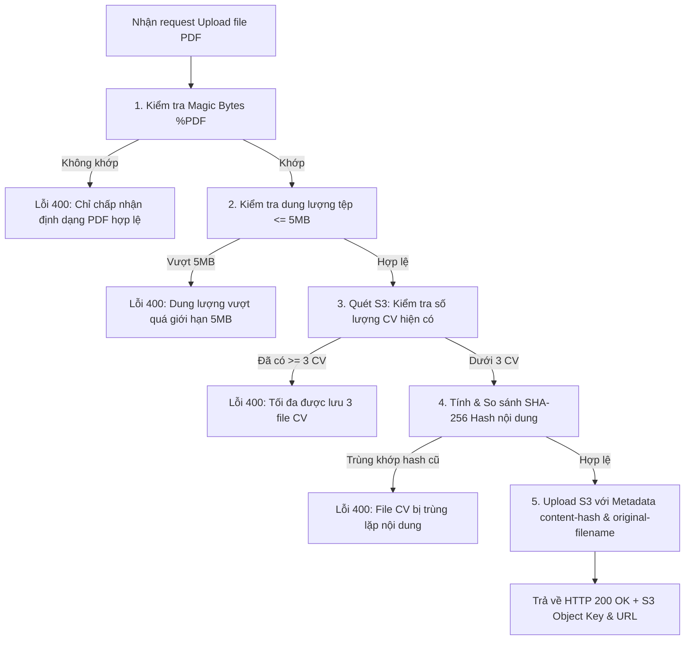

---
title : "Tạo bảng SavedJobs và Lưu trữ S3 CV"
date : 2026-07-02
weight : 2
chapter : false
pre : " <b> 5.4.2. </b> "
---

Thực hiện lưu trữ thông tin có cấu trúc của các tin tuyển dụng yêu thích (wishlist) trên DynamoDB và lưu trữ file CV định dạng PDF của người dùng trên Amazon S3 Bucket với các cơ chế kiểm tra bảo mật nghiêm ngặt.

---

## 1. Luồng xử lý chi tiết (Data Flow)

### A. Tương tác với bảng DynamoDB `SavedJobsTable` (Favorite Jobs)
* **Cấu trúc Khóa:**
  * **Partition Key (PK):** `userId` (Kiểu String `S`, trích xuất từ Cognito Claim `sub`).
  * **Sort Key (SK):** `jobId` (Kiểu String `S`, ID của tin tuyển dụng).


| Thao tác (HTTP Method) | Input nhận được | Logic xử lý vật lý | Output trả về |
| :--- | :--- | :--- | :--- |
| **Thêm Yêu thích** (`POST /saved-jobs/{jobId}`) | Headers: `Authorization: Bearer <Token>` Path: `jobId` = "job-abc" | Lấy `userId` từ token. Gọi `PutItem` lưu bản ghi chứa: `userId`, `jobId`, `savedAt` (ISO String). | `HTTP 201 Created`<br>`{ "message": "Job saved successfully", "item": { "userId": "...", "jobId": "job-abc", "savedAt": "2026-07-01T15:00:00.000Z" } }` |
| **Xóa Yêu thích** (`DELETE /saved-jobs/{jobId}`) | Headers: `Authorization: Bearer <Token>` Path: `jobId` = "job-abc" | Lấy `userId` từ token. Gọi `DeleteItem` có khóa PK = `userId`, SK = `jobId`. | `HTTP 200 OK`<br>`{ "message": "Job removed from saved list" }` |
| **Lấy Danh sách** (`GET /saved-jobs`) | Headers: `Authorization: Bearer <Token>` | Lấy `userId` từ token. Thực hiện lệnh `Query` lấy tất cả bản ghi có PK = `userId`. | `HTTP 200 OK`<br>`{ "count": 1, "items": [ { "userId": "...", "jobId": "job-abc", "savedAt": "..." } ] }` |

Bạn có thể kiểm tra danh sách bản ghi lưu tin tuyển dụng của người dùng trong tab Items trên DynamoDB Console:


### B. Tương tác S3 Storage `CvBucket` (Lưu trữ CV PDF)
* **Quy chuẩn lưu trữ:** Tên tệp lưu dưới dạng khóa: `${userId}/cv_${timestamp}.pdf`.
* **Quy trình kiểm tra nghiệp vụ và bảo mật tải lên:**
  1. **Magic Bytes Verification:** Đọc luồng byte đầu file để kiểm tra xem có khớp với signature `%PDF` (`25 50 44 46` dạng hex) hay không để chặn các file thực thi nguy hại ngụy trang đuôi PDF.
  2. **File Size Check:** Kiểm tra dung lượng tải lên đảm bảo nhỏ hơn hoặc bằng 5MB (`5 * 1024 * 1024` bytes).
  3. **Limit check:** Liệt kê các object trong bucket có tiền tố `userId/`. Nếu số lượng CV hiện có đã lớn hơn hoặc bằng 3, chặn yêu cầu tải lên.
  4. **SHA-256 Hash Deduplication:** Tính toán chuỗi mã băm SHA-256 từ nội dung tệp. Đối chiếu với các thẻ `x-amz-meta-content-hash` của các CV cũ của user trên S3. Nếu khớp, báo lỗi trùng lặp dữ liệu và dừng tải lên.



* **Luồng dữ liệu Upload:**
  * **Input (Client gửi lên):**
    * Header `Authorization`: `Bearer <JWT_ID_TOKEN>`
    * Header `Content-Type`: `application/pdf`
    * Header `x-original-filename`: `NguyenVanA_Resume.pdf` (được encode URL)
    * Request Body: Định dạng binary buffer của tệp PDF.
  * **Output (S3 Upload Lambda trả về):**
    ```json
    {
      "message": "CV uploaded successfully",
      "data": {
        "key": "d74b8c9d-d81a-4b92-91ef-f6d3a82741d4/cv_1782873600000.pdf",
        "url": "https://jobs-matching-cvs-dev-123456789012.s3.ap-southeast-1.amazonaws.com/d74b8c9d-d81a-4b92-91ef-f6d3a82741d4/cv_1782873600000.pdf",
        "originalFilename": "NguyenVanA_Resume.pdf",
        "sizeBytes": 1048576,
        "uploadedAt": "2026-07-01T15:52:00.000Z"
      }
    }
    ```

---

## 2. AWS SAM Template Config (`template.yaml`)

```yaml
  SavedJobsTable:
    Type: AWS::DynamoDB::Table
    Properties:
      TableName: jobs-matching-saved-jobs-dev
      BillingMode: PAY_PER_REQUEST
      AttributeDefinitions:
        - AttributeName: userId
          AttributeType: S
        - AttributeName: jobId
          AttributeType: S
      KeySchema:
        - AttributeName: userId
          KeyType: HASH
        - AttributeName: jobId
          KeyType: RANGE

  CvBucket:
    Type: AWS::S3::Bucket
    Properties:
      BucketName: !Sub "jobs-matching-cvs-dev-${AWS::AccountId}"
      PublicAccessBlockConfiguration:
        BlockPublicAcls: false
        BlockPublicPolicy: false
        IgnorePublicAcls: false
        RestrictPublicBuckets: false
      CorsConfiguration:
        CorsRules:
          - AllowedHeaders:
              - "*"
            AllowedMethods:
              - GET
            AllowedOrigins:
              - "*"
            MaxAge: 3000

  CvBucketPolicy:
    Type: AWS::S3::BucketPolicy
    Properties:
      Bucket: !Ref CvBucket
      PolicyDocument:
        Version: "2012-10-17"
        Statement:
          - Effect: Allow
            Principal: "*"
            Action: "s3:GetObject"
            Resource: !Sub "arn:aws:s3:::${CvBucket}/*"
```

---

## 3. Triển khai (Deployment)
1. Các thành phần Table và Bucket được tự động tạo và cập nhật chính xác khi chạy deployment stack SAM:
   ```bash
   sam build
   sam deploy
   ```

---

## 4. Cấu hình Storage & Kiểm tra (Configuration)
* **DynamoDB Billing Mode:** Sử dụng chế độ thanh toán theo nhu cầu (`PAY_PER_REQUEST`) để tối ưu hóa chi phí.
* **S3 CORS:**
  * Cho phép nguồn gốc (`AllowedOrigins`): Bất kỳ nguồn nào (`*`) hoặc cụ thể domain frontend.
  * Cho phép phương thức (`AllowedMethods`): `GET` (để hiển thị trực tiếp PDF trên trình duyệt thông qua Signed URL hoặc Public Read URL).


* **S3 Bucket Policy:** Chỉ cho phép đọc public đối với tài nguyên hoặc truy xuất bảo mật qua API Gateway.

Sau khi triển khai thành công, bạn có thể kiểm tra cấu hình DynamoDB và S3 trên AWS Console.
